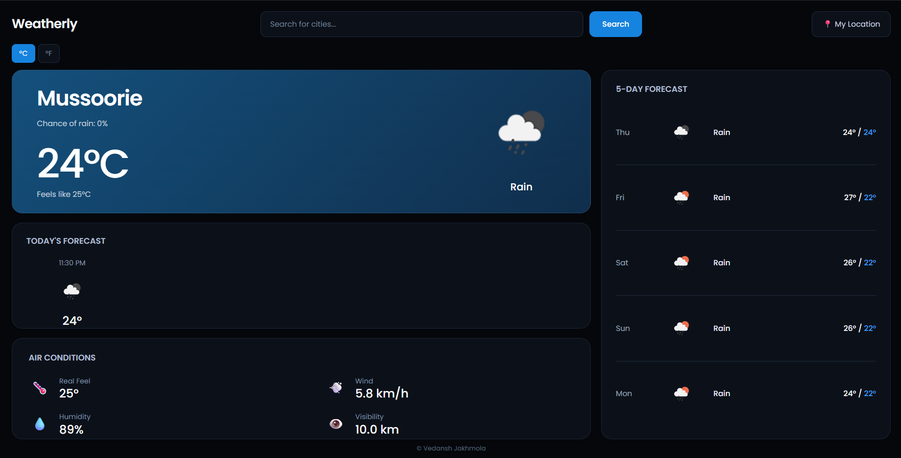

# 🌤️ Weatherly

Weatherly is a modern and responsive weather dashboard built with React and the OpenWeather API.

It provides current weather information, hourly forecasts, a 5-day forecast, air conditions, location-based weather, and Celsius/Fahrenheit conversion through a clean dark-themed interface.

## 📸 Screenshot



## 🚀 Features

- 🔍 Search weather by city
- 📍 Get weather using current location
- 🌡️ Current temperature
- 🌡️ Feels-like temperature
- 🕐 Hourly weather forecast
- 📅 5-day weather forecast
- 💨 Wind speed
- 💧 Humidity
- 👁️ Visibility
- 🌡️ Celsius / Fahrenheit conversion
- 🌦️ Dynamic weather icons
- 🎨 Weather-based current weather card
- 🌙 Day and night weather detection
- ⚡ Loading state
- ❌ Error handling
- 📱 Responsive design
- 🎨 Dark themed UI
- 🔄 Real-time weather data

## 🛠️ Tech Stack

- React
- JavaScript
- HTML5
- CSS3
- OpenWeather API
- Vite
- ESLint
- Git
- GitHub

## 📂 Project Structure

```text
weatherly/
│
├── src/
│   ├── components/
│   │   ├── AirConditions.jsx
│   │   ├── CurrentWeather.jsx
│   │   ├── DailyForecast.jsx
│   │   ├── HourlyForecast.jsx
│   │   └── SearchBar.jsx
│   │
│   ├── services/
│   │   └── weatherApi.js
│   │
│   ├── App.css
│   ├── App.jsx
│   ├── index.css
│   └── main.jsx
│
├── .env
├── .gitignore
├── eslint.config.js
├── index.html
├── package.json
├── package-lock.json
├── README.md
└── vite.config.js